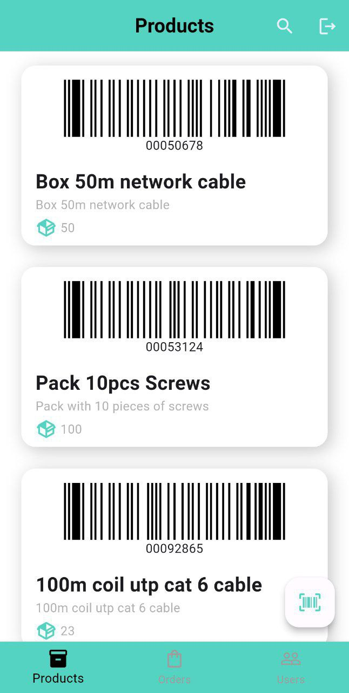

# PickDepartureApp

It is an application to cover the workflow of a product warehouse, allowing the reception of products through barcode scanning, and the output of products through orders by scanning the products.

## Dependencies

- [flutter_barcode_scanner](https://pub.dev/packages/) -> for barcode scanning of the products 
- [barcode_widget: ^2.0.4](https://pub.dev/packages/barcode_widget) -> for generate barcode image
- [get_it](https://pub.dev/packages/get_it) -> for dependency injection management
- [go_router](https://pub.dev/packages/go_router) -> for the implementation and management of navigation
- [lottie: ^2.7.0](https://pub.dev/packages/lottie) -> for the splash page animation
- [sqflite: ^2.3.0](https://pub.dev/packages/sqflite) -> local data persistence
- [intl: ^0.19.0](https://pub.dev/packages/intl) -> used for date formatting
- [material_design_icons_flutter: ^7.0.7296](https://pub.dev/packages/material_design_icons_flutter) -> Used for some application icons
- [shared_preferences: ^2.2.2](https://pub.dev/packages/shared_preferences) -> To save the logged-in user status
- [firebase_core: ^2.24.2](https://pub.dev/packages/firebase_core) -> for connection to Firebase
- [firebase_analytics: ^10.8.0](https://pub.dev/packages/firebase_analytics)
- [cloud_firestore: ^4.14.0](https://pub.dev/packages/cloud_firestore) -> for remote data persistence
- [url_launcher: ^6.2.3](https://pub.dev/packages/url_launcher) -> to open the native call function

## Architecture

The project follows the Clean MVVM architecture, which consists of the following layers:

- Presentation Layer: Contains the UI pages, view models, and custom widgets.
- Domain Layer: Contains the repositories.
- Data Layer: Contains the models and implementation of the repositories
- Dependency Injection: Uses Get_it for dependency injection.

## Screenshots

